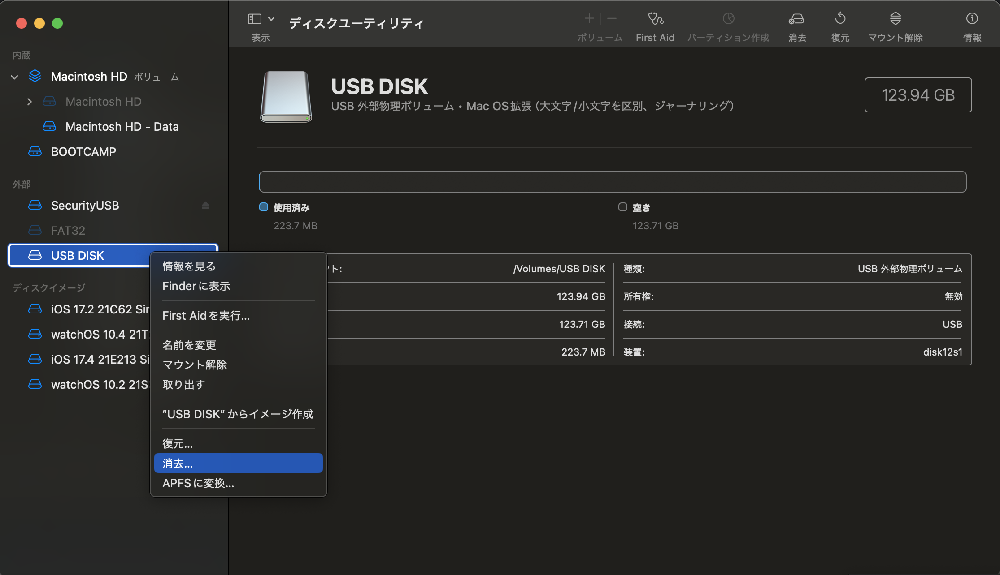
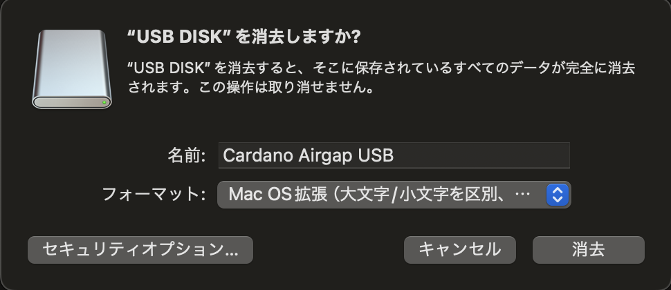
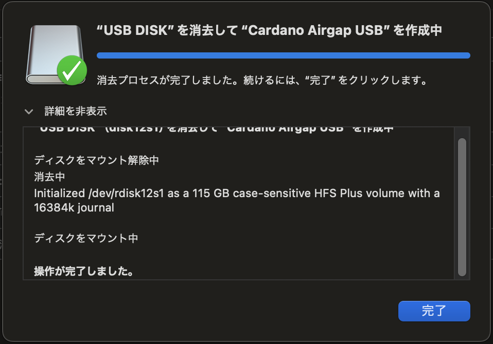
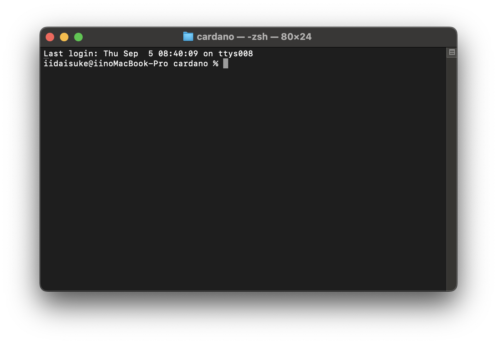

# **エアギャップマシン作成(Docker版)**

!!! danger "注意"
    このマニュアルはα版です！

    また、Windows環境についてはまだ対応しておりません！


!!! summary "エアギャップマシンとは？"
    プール運営で使用するウォレットの秘密鍵やプール運営の秘密鍵をオフライン上で管理し、エアギャップオフラインマシンでCLIを起動しトランザクションファイルに署名する作業に使用します。
    
    * ウォレットの秘密鍵やプール運営の秘密鍵をプール運営のオンラインマシン上に保管すると、ハッキングなどの際に資金盗難のリスクがあります。


!!! summary "Dockerとは？"
    Dockerは、アプリケーションをコンテナと呼ばれる軽量な仮想環境で実行するためのオープンソースソフトウェアです。これにより、環境依存を解消し、効率的な開発とデプロイが可能になります。

## **インストール要件**

!!! info "動作環境"
    **[Docker Desktop](https://www.docker.com/ja-jp/products/docker-desktop/) などDockerが動作する環境**

    * macOS (Intel チップ)
    * macOS (Apple Silicon)
    * Windows 11 Home, Pro
    
    ディスク容量 1GB程度

!!! info "ダウンロード/インストール"
    
    * Docker Desktop
    * airgap-1.x.x.tar.gz

## **1- Docker Desktop のインストール**

=== "macOS"

    インストール方法が2つあります。ご自分のやりやすそうな手順を選択してください。

    === "Homebrewを使用したインストール"

        **Homebrewのバージョン確認**

        ```Bash
        brew --version
        ```
        > Homebrew 4.3.18


        **インストール**
        
        ```Bash
        brew install docker --cask
        ```


    === "ブラウザで手動インストール"
    
        **以下のページにアクセスします**

        [Docker Desktop](https://www.docker.com/ja-jp/products/docker-desktop/)
    
        
    
        **今すぐ始める**の右側のダウンロードボタンからインストーラーをダウンロードします。
    
        !!! danger "注意"
            お使いのmacのチップにあわせてダウンロードしてください。
    
             | Intelチップの場合   | Apple Sliconの場合    |
             |-------------------|------------------------------------|
             | Mac版のダウンロード - Intelチップ | Mac版をダウンロード - Apple Silicon |
    
        **インストール**
    
        ダウンロードした `Docker.dmg` をダブルクリックしてインストールします。

                
    
        


=== "Windows"

    1-1. 下の画像の赤い四角のところをクリックしてダウンロードします。
    
    * [Docker Desktop の入手](https://www.docker.com/ja-jp/products/docker-desktop/)
    
    
## **2- Docker Desktop の設定**

=== "macOS"

    2-1. Launchpadなどから`Docker Desktop`を起動します。

    


    2.2. macOS起動時の設定を変更します。

    `General` タブの以下の設定を変更します。
    
    - Start Docker Desktop when you sign in to your computer
    -- チェックする
    - Open Docker Dashboard when Docker Desktop starts
    -- チャックを外す

    


    2.3. `Apply & restart` ボタンを押下して設定を反映させます。


=== "Windows" 
    
    2-1. ダウンロードした、`Docker Desktop` のインストーラーをダブルクリックして起動する。
    
    | ファイル名                     |
    |------------------------------|
    | Docker Desktop Installer.exe |
    
    
    


## **3- Dockerイメージのダウンロード**

!!! info "複数プールをお持ちの場合"

    先に、[複数プールへの対応](#9-)をご覧下さい。


=== "macOS"

    3-1. エアギャップを配置するディレクトリを作成

    === "通常版"

        エアギャップを配置するための `cardano` ディレクトリを作成します。
    
        以下の図の場所に作成をしましたが、別の場所でも構いません。
        

    === "USB版"

        !!! danger "注意"
            FAT32やexFATなどのフォーマットでは上手く動作しない場合があります。

        **USBメモリをフォーマットします。**

        Launchpadなどから「ディスクユーティリティ」を起動し、対象のUSBメモリを右クリックしたメニューから「消去」を選択します。
        

        「名前」には分かりやすい名前をご自由に設定してください。
        「フォーマット」は「Mac OS拡張（大文字/小文字を区別、ジャーナリング）」を選択してください。
        

        フォーマットが終わったら「完了」を押下して、「ディスクユーティリティ」を閉じます。
        

        USBメモリ内に「cardano」ディレクトリを作成します。
        

    **3-2. ターミナルを起動します**

    先ほど作成した `cardano` ディレクトリを右クリックし、ターミナルを起動します。
    


    **3-3. ターミナルのカレントディレクトリを確認**
    
    
    
    
    **3-4. Docker(-compose)定義のダウンロード**

    === "通常版"
    
        ```Bash
        wget https://e-frontier.systems/cardano-tools/airgap-latest.tar.gz -O airgap.tar.gz
        ```

    === "USB版"

        ```
        wget https://e-frontier.systems/cardano-tools/airgap-usb-latest.tar.gz -O airgap.tar.gz
        ```
    
    **3-5. ダウンロードファイルのハッシュ値を確認**
    !!! warn "ハッシュ値を確認する理由"
        ハッシュ値は、ファイルの内容を特定のアルゴリズムで計算して得られる固定長の文字列で、ファイルの内容が少しでも変わるとハッシュ値も大きく変わるため、ファイルが改ざんされていないかを確認する非常に有効な手段です。

    === "通常版"

        ```Bash    
        shasum -a 256 airgap.tar.gz
        ```
        > 2aabab94f09691b178ec5874578d8cb7448817fa98ded78e8e4e76f94c538684

    === "USB版"

        ```Bash    
        shasum -a 256 airgap.tar.gz
        ```
        > acfba3b76b03c115d80a43d15147782c075fb65d083ca2cf354c991b9bdeffec
        
    
    **3-6. ダウンロードファイルを解凍します**
    ```Bash
    tar xvf airgap.tar.gz
    ```


    **3-7. 解凍したフォルダへ移動します**
    ```Bash
    cd airgap
    ```

=== "Windows"

    3-1. コンソールを開きます


## **4- エアギャップの初期設定**

### 4-1. ビルド

```Bash
./build.sh
```
!!! warning "エラーになる場合"
    以下のコマンドを実行してシェルスクリプトの実行権限を付与してみてください。
    ```Bash
    chmod +x *.sh
    ```
    それでもエラーになる場合は、`ls`コマンドで`Dockerfile`などが見えるか確認してください！<br />
    `airgap`ディレクトリ内で実行をする必要があります。


### 4-2. 起動

```Bash
./start.sh
```


### 4-3. ログイン

```Bash
./login.sh
```
コンソールの表記が変わり、エアギャップにログイン出来ます。

> To run a command as administrator (user "root"), use "sudo <command>".
> See "man sudo_root" for details.
> 
> cardano@a48d8df1282e:~$


!!! information "確認"
    試しに、`cardano-cli`のバージョンを確認してみましょう！
    ```Bash
    cardano-cli version
    ```
    > cardano-cli 9.2.1.0 - linux-x86_64 - ghc-8.10
    > git rev efd560070aaf042d1eb4680ae37fc607c7742319


**おめでとうございます🎉
これでエアギャップが構築されました！**

あとはキーをエアギャップにキーを設定するとエアギャップとして機能するようになります！

!!! danger "注意"
    ここからはキーファイルを扱うためネットワークから切断する事を強くお勧めいたします。

### 4-4. コールドキーを準備

`airgap`フォルダ内の`share`フォルダ内に、`cold-keys`フォルダと、`cnode`フォルダがあらかじめ準備されています。
各フォルダ内には空のファイルが用意されていますので、既存のエアギャップより同じファイル名のファイルを上書きコピーしてください。

- cnode/
    - payment.addr
    - payment.skey
    - payment.vkey
    - stake.addr
    - stake.skey
    - stake.vkey
- cold-keys/
    - node.counter
    - node.skey
    - node.vkey


### 4-5. コールドキーをエアギャップに取り込む

先ほど上書きしたファイルをエアギャップに取り込みます。
先ほどエアギャップにログインしたコンソール上で以下のコマンドを実行してください。
```Bash
copy-keys
```

!!! danger "注意"
    正常にコピーされた事を確認した後、先ほど上書きコピーした`share`フォルダ内の`cold-keys`フォルダと、`cnode`フォルダを**必ずUSBメモリ等にバックアップしたうえで削除してください！**


## **6- ログアウトと停止**

### 6-1. ログアウト

エアギャップからログアウトするには`exit`コマンドを実行するだけです。
```Bash
exit
```


### 6-2. 停止

ログアウトしたままではエアギャップは動作し続けています。停止させるには以下のコマンドを更に実行してください。
```Bash
./stop.sh
```


### 6-3. 取り出し

USBの場合は停止しただけではUSBを安全に取り外す事が出来ません。
代わりに以下のコマンドを使用してください。
```Bash
./shutdown.sh
```


## **7- 共有フォルダについて**

7-1. 共有フォルダについて

!!! info "ホストOSとエアギャップ間の共有フォルダ"

    共有ディレクトリは以下のように設定されています。

    - ホストOS(macOS): `cardano/airgap/share` ディレクトリ
    - エアギャップ: `/mnt/share`

    ``` mermaid
    graph LR
        A["cardano/airgap/share"] <-->|共有フォルダ| B["/mnt/share"];
    ```


## **8- 各種操作について**

### **8-1. ctool (ctool.sh) について**

!!! information "概要"
    gtoolのエアギャップ専用版です。
    gtoolと連動してより簡単に操作ができるようにし、操作ミスを減らせるように開発しています。


現時点で出来ること
- ウォレット操作
  - 報酬の引き出し
- KESの更新
- 初期設定
- cardano-cliのバージョンアップ
- ctoolのバージョンアップ


### **8-2. ctool.shのバージョンアップ**

1. `share`フォルダに新しいバージョンの`ctool.sh`をUSBメモリなどで持ってきて貼り付けます。
2. エアギャップにログインして、以下のコマンドを実行します。
    ```Bash
    cp /mnt/share/ctool.sh $HOME/bin/
    rm /mnt/share/ctool.sh
    ```


### **8-3. cardano-cliのバージョンアップ**

1. `./share`フォルダに新しいバージョンの`cardano-cli`をUSBメモリなどで持ってきて貼り付けます。
2. エアギャップにログインして、以下のコマンドを実行します。
   ```Bash
   sudo mv /mnt/share/cardano-cli /usr/local/bin/cardano-cli
   ```
3. エアギャップにて、以下のコマンドを実行しバージョンを確認します。
   ```Bash
   cardano-cli version
   ```


### **8-4. 報酬出金時トランザクションに署名する**

`./share`フォルダに`tx.raw`を貼り付けます。
```Bash
sign
```
`./share`フォルダに`tx.signed`が出力されます。

### **8-5. KESの更新**

ctoolを使用してください。


## **9- 複数プールへの対応**

9-1. 複数プールへの対応も可能です

複数のプールを運営されている方も1台のPCで複数のエアギャップを運用することが可能です。

`3-6. ダウンロードファイルの解凍' にて案内しているコマンド
```Bash
tar xvf airgap.tar.gz
```
その後に、以下を実行します（`01`はお好きな半角英数字に変えてもOKです。）
```Bash
mv airgap airgap-01
```

以降、エアギャップを増やす度に、
```Bash
tar xvf airgap.tar.gz
mv airgap airgap-02
```

```Bash
tar xvf airgap.tar.gz
mv airgap airgap-03
```

のようにフォルダ別けしていきます。
